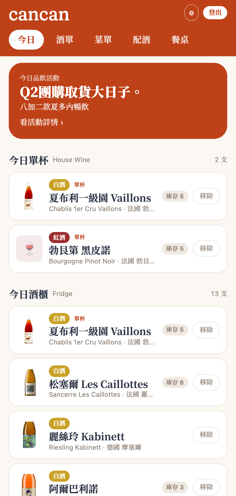
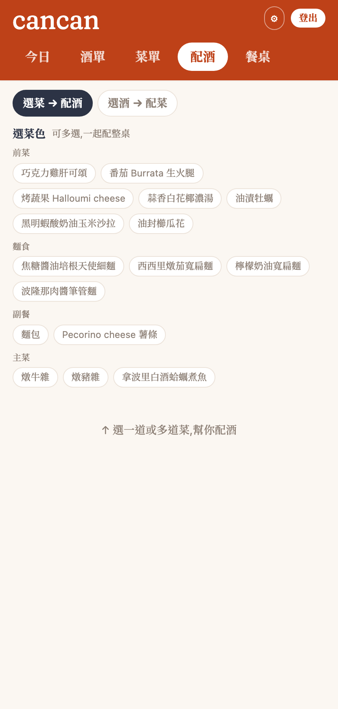
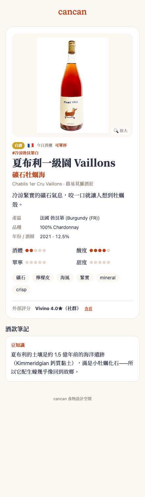
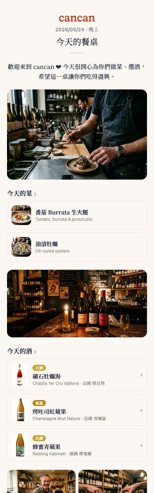
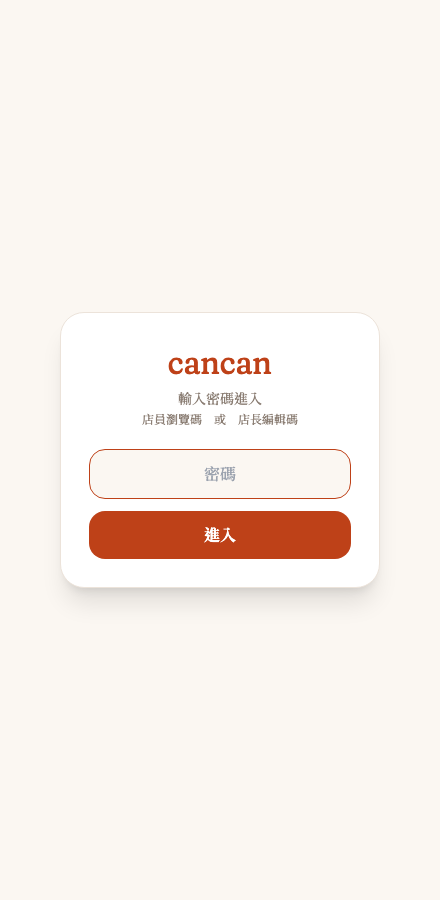
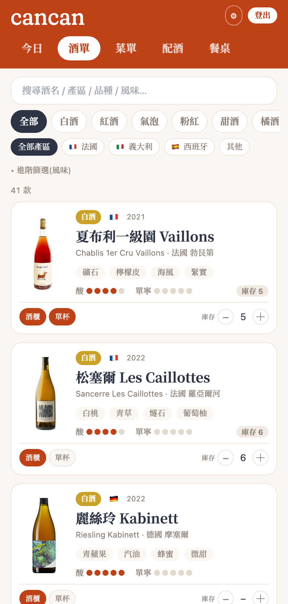
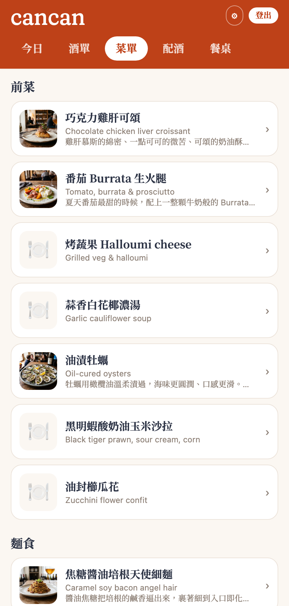

# cancan 酒款管理 — 用一張 Google Sheet 長出一整套 wine bar App · AI 協作開發全紀錄

> 🤖 **我用 AI 做了什麼**：從零幫一間台北 natural wine bar 做了一整套酒款管理工具——用 Apps Script 把一張 Google Sheet 變成資料庫、長出 10 個分頁，再拉出一個手機 App（今日酒櫃／單杯／酒單篩選／菜單／雙向配酒／酒款詳情／瓶頸小卡 QR／品飲活動／今日餐桌），最後發佈成可安裝的 PWA。全程我不會寫程式，只描述情境與感覺，AI 負責設計資料結構、寫前後端、部署、生示範照、上網查資料。
> ⏱ **沒有 AI 的話**：這種「資料庫 + 後端 API + 手機 App + 部署」的東西，對不會寫程式的我來說等於外包——等報價、等排期、來回改字級改顏色會是好幾週、好幾萬塊的事。
> ✅ **最終成果**：一個店員手機上 3–4 次點擊就查到酒、改 Google Sheet 就即時更新、不用重新發版的工具。已上線、可安裝到手機桌面。

> cancan 食物設計空間是一間台北的 natural wine bar（主理人 林擠米 Jimmy／Moa／Boggy）。這份紀錄涵蓋**整個專案**，從最初的痛點，一路到今天的完整工具。

---

## 一、為什麼要做這件事

起點是三個很具體、每天都在發生的營運痛點：

1. **酒商資料整理到天荒地老**：合作 20–30 家酒商，給的資料格式天差地遠——有的是 PDF、有的是手機拍的 JPG、有的是一句話塞在 Excel 總表裡。每進一批酒，就要自己重新整理、還要上網查產區/葡萄品種/酒精度補齊。
2. **店員記不住 50–60 款酒**：natural wine 名字又長又難記，店員忙起來根本沒空好好跟客人介紹，更別說推薦搭配。
3. **菜單常換，配酒要跟著重排**：cancan 是「食物設計空間」，菜會換，每換一次菜，哪支酒配哪道菜就要重想一輪。

我想要的最終狀態很明確：**用「一張 Google Sheet」管理全部酒款，店員在手機上查得到、AI 幫忙產草稿、我只要在 Sheet 上審核，App 就即時更新。** 並且要能自動產出兩個交付物——印出來綁在瓶頸上的「瓶頸小卡」，跟「依菜推酒」的配酒建議。

---

## 二、最終樣貌

一個部署在 Vercel、可安裝到手機的 PWA，後面接一張 Google Sheet 當資料庫。主要畫面：

- **今日**（預設頁）：今日活動橫幅 + 今日單杯（House Wine）+ 今日酒櫃，店員打開就看到「今天有什麼可以賣、可以推」。
- **酒單**：全部在架酒，可用風味 / 國家篩選，點進去看詳情。
- **菜單**：當期菜色，含照片與介紹。
- **配酒**：雙向——「選菜 → 配酒」幫整桌配，或「選酒 → 配菜」。
- **酒款詳情**：品飲分數、風味標籤、酒莊故事 / 豆知識 / 店內品酒筆記、侍酒備註、外部評分（Vivino 等），底部可生瓶頸小卡 + QR。
- **品飲活動**：辦品酒會時，把 Config 一個開關打開就出現「今日活動」頁。
- **今日餐桌**：遇到值得紀念的一桌，店長挑今天的菜/酒、側拍照、寫開場白與手寫感謝，生成 `?s=` 專屬連結 + QR 送給客人收藏。
- **兩層登入**：店員「瀏覽碼」只能看、店長「編輯碼」可改；客人連結免登入、且看不到任何內部資料。

<p>
  &nbsp;
  &nbsp;
  &nbsp;
  
</p>

<sub>左起：今日（單杯＋酒櫃）· 配酒（雙向）· 酒款詳情＋外部評分 · 今日餐桌（客人回憶頁）</sub>

---

## 三、系統架構

整套工具是**三層**，核心理念：**Google Sheet = 唯一真相來源（資料庫）＋人工審核面；AI 只產草稿，老闆核可後才上線；前端與任何工具都只讀後端吐的 JSON。**

```
店長/店員 ─登入碼─┐
                  ▼
Google Sheet（資料庫）  →  Apps Script Web App（JSON API）  →  網頁 App（Preact，部署 Vercel，PWA）
  · Wines / Menu /            · doGet 唯讀 JSON（依權限分三種回應）      · 今日 / 酒單 / 菜單 / 配酒 / 詳情
    Pairings / WineNotes /    · doPost 寫入（草稿）；回饋走免密碼通道       · 瓶頸小卡 + QR / 品飲活動 / 今日餐桌
    FlavorVocab / Config…     · 公開資料自動「瘦身」(去掉成本/內部筆記)     · 客人頁 ?w= / ?d= / ?s=（免登入）
  · 10 個分頁                  · 中文表頭 ↔ 英文 key 自動轉換
  · 3 個 Drive 照片資料夾
```

**為什麼用 Google Sheet 當資料庫**：老闆本來就會用試算表。把「資料庫」做成一張他看得懂、能直接手改的 Sheet，就不需要再學任何後台系統——**改 Sheet = 改線上資料**，這是整個設計的靈魂。

關鍵概念：**同一個 App、三種人看到不同東西**——客人（公開、瘦身過、看不到價格與內部筆記）、店員（瀏覽碼、看得到內部小抄但不能改）、店長（編輯碼、全權）。

---

## 四、資料庫：10 張表怎麼分工

整張 Google Sheet 有 10 個分頁。它們不是一條平的清單，而是有「角色」之分——**Wines（酒款主表）是中心，其他表不是繞著它記細節（明細），就是把它和別張表牽起來（橋接），或是被它查詢（字典／查找表）。** 想通這層分工，就懂整個資料庫怎麼運作。

```
                Vendors ─┐        ┌─ Countries          ← 查找表（被 Wines 參照）
                         │        │
   FlavorVocab ──tags──► │ Wines  │ ◄──country
        ▲                │ 中心★  │
        │ flavorProfile  └───┬────┘
        │             wineId │ wineId
       Menu ◄──Pairings──────┤                          ← 橋接表：菜↔酒 多對多
        │   (多對多)         ├──► WineNotes              ← 明細：一支酒多則筆記
        │                    └──► Feedback               ← 明細：客人回饋
        └──► Sessions  （今日餐桌：引用 Wines+Menu 的 id 做快照）

   Config（全店設定開關，與酒無直接關聯）
```

### 最關鍵的一組關係：菜 ↔ 酒 是「多對多」

「一道菜可以配多支酒、一支酒也可以配多道菜」——這種關係塞不進任何一張主表，所以中間放一張 **Pairings** 專門記每一組搭配（`Menu ↔ Pairings ↔ Wines`）。這張「橋接表」帶 `rank`／`score`，就是配酒功能能**雙向查**（選菜配酒、選酒配菜）的關鍵。

### 10 張表各自的角色

| 分頁 | 角色 | 主要目的 | 怎麼關聯 |
|---|---|---|---|
| **Wines** 酒款 | 中心主表 | 一支酒一列：規格、價格、庫存，及三個獨立開關 active／inFridge／byGlass | 被其他表用 wineId 指向 |
| **WineNotes** 酒款筆記 | 明細（1 對多） | 一支酒多則筆記：豆知識／酒莊故事／店內品酒；分客人看與店員看 | wineId → Wines |
| **Feedback** 客人回饋 | 明細（1 對多） | 記客人口味反饋（店員走免密碼通道寫入） | wineId／dishId |
| **Menu** 菜單 | 主表 | 菜色（常換）：中英名、描述、價格、風味 | 透過 Pairings 連 Wines |
| **Pairings** 配酒 | 橋接（多對多） | 一列＝一組 (菜, 酒)；手動/規則/AI，AI 產的要核可才上線 | dishId→Menu、wineId→Wines |
| **FlavorVocab** 風味詞庫 | 字典（共用） | 酒與菜的共同風味詞；避免 AI 風味詞亂飄、重複 | 被 Wines.tags 與 Menu.flavorProfile 取用 |
| **Vendors** 酒商 | 查找表 | 20–30 家酒商；追貨源、算毛利 | 被 Wines.vendor 參照 |
| **Countries** 國家 | 查找表 | 國名中英／國碼對照（小卡上的「產區 (國碼)」） | 被 Wines.country 參照 |
| **Config** 設定 | 設定開關 | 全店開關：是否顯示售價、品飲活動、照片資料夾 ID | 獨立，與酒無直接關聯 |
| **Sessions** 今日餐桌 | 快照 | 一筆＝一張客人回憶頁（當天的菜/酒/側拍照） | wineIds／dishIds 引用 Wines/Menu |

### 三種關係，一句話記

| 關係 | 哪些表 | 白話 |
|---|---|---|
| 主表 → 明細（1 對多） | Wines → WineNotes／Feedback | 一支酒，很多則筆記/回饋 |
| 橋接（多對多） | Menu ↔ Pairings ↔ Wines | 菜和酒互相配，中間用一張表記 |
| 字典／查找（被參照） | FlavorVocab／Vendors／Countries | 共用詞庫與對照表，避免各寫各的 |

### 資料怎麼流

1. **審核流**：AI 產草稿寫進 `Wines`（標 `draft`）→ 老闆在 Sheet 審 → 變 `reviewed` → 客人才看得到。
2. **三層可得性**：`active`（庫房有貨）→ 勾 `inFridge`（進今日酒櫃）→ 勾 `byGlass`（今日單杯）；App「今日」頁就讀這三個開關。
3. **配酒比對**：靠 `FlavorVocab` 當共同詞庫，把 `Menu` 的風味比對 `Wines` 的風味標籤。

## 五、技術選型

| 選擇 | 為什麼選它 |
|---|---|
| **Google Sheet 當資料庫** | 老闆會用試算表；改資料不用工程師、不用後台，直接編格子就好 |
| **Apps Script Web App** | 免費、免主機、跟 Sheet 同源；`doGet` 吐 JSON、`doPost` 寫回，一個檔搞定後端 |
| **Preact + htm + Tailwind（走 CDN，零 build）** | 整個前端就一個 `index.html`，沒有 build step、沒有 node_modules；改完直接部署 |
| **Vercel + PWA** | 一行指令部署；PWA 讓店員把它「裝」到手機桌面，像 App 一樣開 |
| **JSONP 讀 / text/plain 寫** | Apps Script 跨網域有 CORS 限制；GET 用 JSONP、POST 用 text/plain 繞過瀏覽器的預檢 |
| **中文表頭 ↔ 英文 key 機制** | Sheet 上顯示中文表頭（老闆看得懂），程式裡一律用英文 key（好寫）；兩邊自動轉換 |
| **Fraunces（標準字）+ LXGW WenKai TC（手寫字）** | wordmark 要「軟襯線」的調性；今日餐桌的手寫感謝用手寫字體渲染，比放照片真 |
| **外部評分「查一次存起來」** | Vivino / Wine-Searcher 沒開放 API、不能即時抓；改成進酒時查一次填進 Sheet |

---

## 六、從零到上線的歷程

### 5-1. 先把資料結構想清楚（Sheet 的 10 個分頁）

第一步不是寫程式，是**設計資料庫**。AI 幫我把營運裡的每個概念對到一個分頁：

- **Wines**（酒款主表）：一支酒一列，含身分、產區、葡萄、品飲分數、風味標籤、文案、價格、進價、酒商、庫存……還有三個關鍵的獨立開關——`active`（有進貨可賣）、`inFridge`（今日在酒櫃）、`byGlass`（今日有單杯）。這三個對應店裡真實動線：庫房 → 今日酒櫃 → 今日單杯。
- **WineNotes**（店內知識庫）：一支酒對多筆筆記，分豆知識 / 酒莊故事 / 店內品酒 / 侍酒建議；分「店員看」與「客人看」兩種可見度。
- **Menu**（菜單）、**Pairings**（配酒，可手動 / 規則 / AI、雙向查）、**FlavorVocab**（風味詞庫，讓酒和菜講同一種語言）、**Feedback**（客人回饋）、**Vendors**（酒商）、**Countries**、**Config**（全店設定 + 品飲活動開關）。
- 後來又加了第 10 個 **Sessions**（今日餐桌）。

> **學到的事**：做工具最值錢的一步是「把營運語言翻成資料結構」。這步想清楚，後面前端怎麼長都順；想偏了，後面一直打結。

### 5-2. 中文表頭 ↔ 英文 key —— 讓老闆和程式都舒服

老闆要在 Sheet 上看到「品名 / 產區 / 售價」這種中文表頭；但程式裡用中文當欄位名是惡夢。AI 設計了一層對照表（`HEADER_LABELS`）：**讀資料時把中文表頭轉成英文 key，寫資料時再轉回中文。** 老闆看到的是中文、程式吃到的是英文，兩邊都舒服。這層機制是後面所有功能的地基。

### 5-3. 後端：一個 Apps Script 檔搞定讀寫

- **doGet（唯讀 JSON）**：店員/店長帶密碼拿「完整資料」；客人不帶密碼拿「瘦身過的公開資料」。
- **doPost（寫入）**：店長帶密碼可新增/修改/刪除；另開一條免密碼通道讓店員記錄客人回饋（只能寫進 Feedback、欄位白名單）。
- 部署成「任何人可存取」的 Web App，前端就能免金鑰讀取。

### 5-4. 前端：一個 HTML 長出一整套 App

所有畫面都在一個 `index.html` 裡，用 Preact 的 `view` state 切換。一個一個長出來：

- **今日**：把 `inFridge` / `byGlass` 兩個開關變成「今日酒櫃 / 今日單杯」兩區。
- **酒單 + 風味/國家篩選**：店員可以「我要找清爽一點的白酒」這樣篩。
- **菜單 / 雙向配酒 / 酒款詳情**：配酒可以「選菜配酒」也可以「選酒配菜」。
- **瓶頸小卡 + QR**：詳情頁能生一張極簡的小卡（詩意名 + 風味 + 酸度單寧圓點），印出來綁瓶頸；QR 連到該酒的客人頁。
- **品飲活動**：Config 一個開關打開，就出現「今日活動」頁。

### 5-5. 發佈成 PWA

加上 manifest 與 service worker，店員就能把網址「加入主畫面」，開起來沒有瀏覽器網址列，像原生 App，還能離線開上次的資料。**對店員來說，它就是一個 App，不知道也不需要知道後面是一張 Google Sheet。**

### 5-6. 今日餐桌（最後加的回憶頁功能）

遇到很有趣、吃得很開心的一桌，店長想送他們一頁「今天的餐桌」當回憶——挑今天的菜/酒、挑店裡側拍照、寫開場白與手寫感謝、選版型（信箋／卡片／雜誌），生成 `?s=` 專屬連結 + QR 給客人收藏、分享到 IG。

### 5-7. 外部評分 + 兩層登入（順手補的兩件事）

- **外部評分**：酒款詳情頁顯示 Vivino 等第三方評分增加說服力；18 支在架酒用 AI 查好填上。
- **兩層登入 + 公開資料瘦身**：今日餐桌會把工具網址交到客人手上，這逼出一個本來沒注意的隱私問題——客人會不會摸到內部後台？答案是會，連客人頁背後的資料都含進價、內部筆記。於是把它重整成「兩層密碼 + 公開資料自動去掉敏感欄位」。

<p>
  &nbsp;
  &nbsp;
  
</p>

<sub>左起：兩層登入閘門 · 酒單（可篩選）· 菜單</sub>

---

## 七、AI 怎麼幫我做的

- **分工**：我負責「要做什麼、像不像、放哪裡、哪裡怪」；AI 負責全部實作（設計 Sheet 結構、寫前端 Preact、寫後端 Apps Script、部署上線、用 AI 生示範照片、上網查酒的評分）。我幾乎只看截圖給回饋。
- **提問模式**：以「**情境描述**」開頭（例：「店員記不住 50 款酒」「遇到有趣的一桌想送回憶」），AI 先給**做法建議＋老實講限制**，談好方向才動手；接著是「**看截圖 → 微調**」的快速來回（字級小 20%、間距收一點、這個拉出來變常駐按鈕…）。
- **關鍵轉折**：
  1. **先設計資料、再寫程式**：一開始我急著要看到 App，但 AI 堅持先把 Sheet 的分頁/欄位攤開討論。事後證明，這個前置討論讓後面每個功能都長得很順。
  2. **「資料是開關、App 是畫面」**：今日酒櫃不是另開一張表，而是 Wines 表上一個勾選格；今日活動不是新功能，是 Config 裡一組開關。這個想法讓老闆「改格子 = 改畫面」，不用每次找我。
  3. **「手寫卡看起來很假」**：今日餐桌的手寫感謝，本來想放一張手寫照片，怎麼看都假。AI 改成用手寫字體渲染文字——原來「溫度」來自字體呈現，不是貼一張更精緻的圖。
  4. **隨口問的隱私疑慮變成必要修補**：我問「客人拿到連結會不會摸到後台」，AI 老實說「比你想的更曝露」，把一個許願功能變成一次安全重整。

---

## 八、踩到的坑，讓我更懂的事

- **方便 = 漏洞**：原本店員免登入就能瀏覽，看似貼心，其實代表客人也能摸到同一個畫面、甚至背後資料含成本與內部筆記。
  > 帶走的原則：「誰都能看」對內部工具來說不是方便，是風險；該分層就要分層。
- **第三方資料不一定有 API**：想顯示 Vivino 評分，但它沒開放 API、爬蟲又違規；自然酒/小農更常根本沒評分。
  > 帶走的原則：先問「這個資料拿得到嗎、拿了能用嗎」，再決定要不要做即時，多數時候「查一次存起來」就夠。
- **像照片就是假**：模擬手寫感謝時，貼 AI 生成的手寫卡照片怎麼看都假；改成用手寫字體把字排在頁面上、背景跟頁面一致，立刻就對了。
  > 帶走的原則：要「真」，有時是讓它變回「純文字 + 對的字體」，而不是塞一張更精緻的圖。
- **跨網域的眉角（CORS）**：Apps Script 的 Web App 從別的網域讀寫會被瀏覽器擋；GET 要用 JSONP、POST 要用 text/plain 才繞得過。這種「環境細節」是自己摸絕對會卡很久、但 AI 一句話就解掉的地方。
- **部署的存取權限要設對**：Web App 部署成「任何人」跟「任何有 Google 帳號的人」差很多，後者會變成登入牆；而且自己登入的瀏覽器兩種都看得到，是假象，要用無痕視窗驗證。
- **改了就驗證**：每次調完 AI 都先在本機預覽、截圖確認再上線；連「收合工具時殘留的 QR 視窗」這種小 bug 也是這樣抓到的。
  > 帶走的原則：小步快跑 + 每步看成品，比一次做完再檢查可靠。

---

## 九、Takeaway

- **這個案例展示的思路**：非工程師也能主導開發一整套工具——重點不是會不會寫程式，而是**會描述情境、會把營運語言翻成資料結構、會判斷「像不像/順不順」、敢追問**。最有效的模式是「先講情境讓 AI 提方案 + 看截圖快速迭代」。
- **最值錢的設計決策**：把 Google Sheet 當資料庫、讓「改資料 = 改畫面」。老闆不用學任何後台，工程（AI）不用每次因為改一筆酒就重新發版。這套「Sheet 當資料庫 + 網頁 App + AI 當工程師」非常適合小店自己養工具（餐廳、咖啡、選物店）。
- **不要照搬的期待**：「免費即時抓第三方評分（Vivino 等）」這種多數平台沒 API，務實做法是查一次存起來；自然酒甚至常常沒評分，要能接受留白。
- **如果你也要做，先問 AI 什麼**：
  1. 「我想做一個管理〔某某〕的工具，先別寫程式，幫我把『資料怎麼存、要分哪些表、每張表有哪些欄位』先設計好，並指出我沒想到的欄位。」
  2. 「我想加〔某功能〕，先別寫，幫我把做法、取捨、還有有沒有隱私/權限問題講清楚。」
  3. 「這個畫面我覺得〔哪裡怪〕，幫我調〔字級/間距/位置〕，先在本機預覽截圖給我看再上線。」

*整理自 AI 協作對話，2026-05-24*
