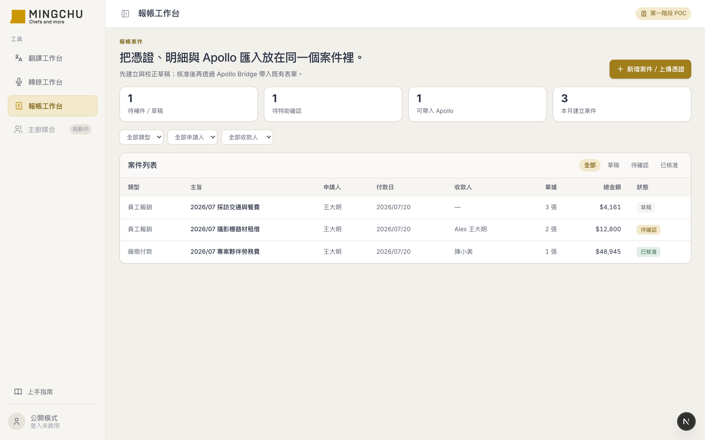
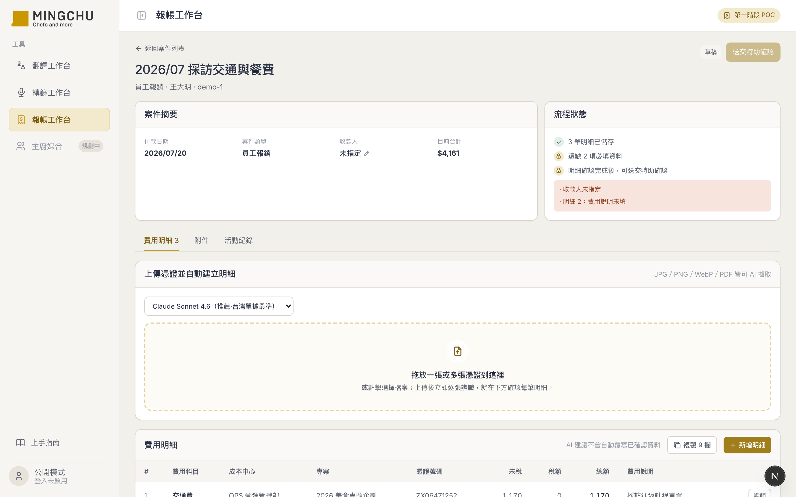
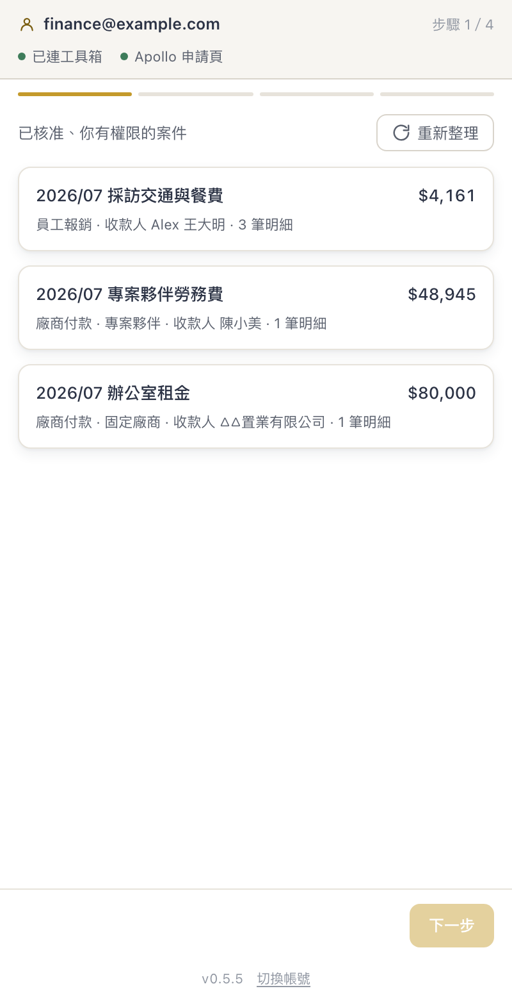
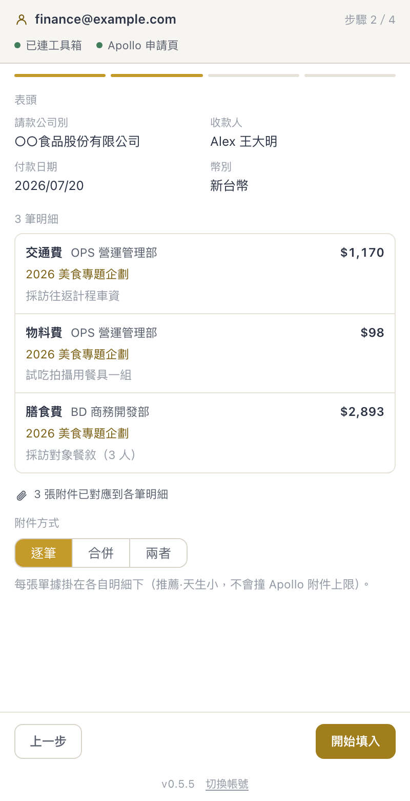
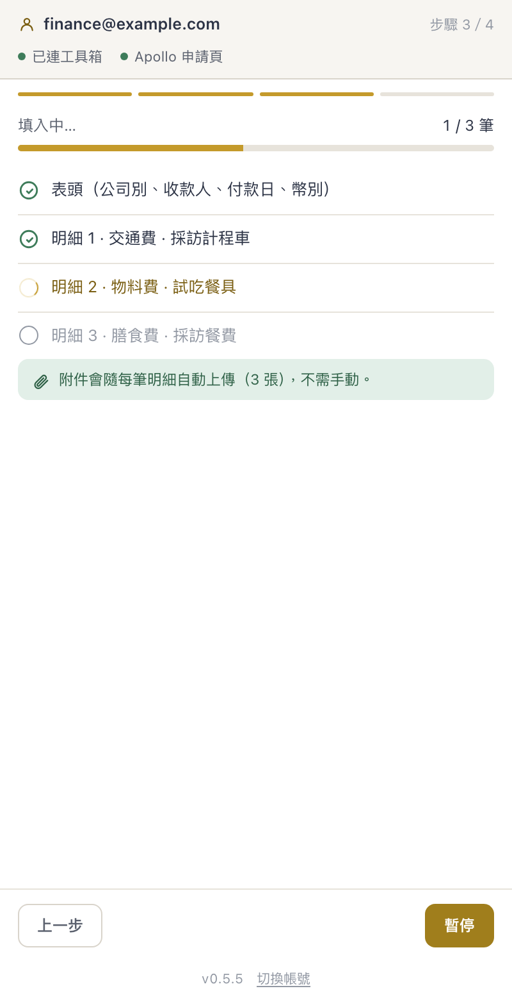
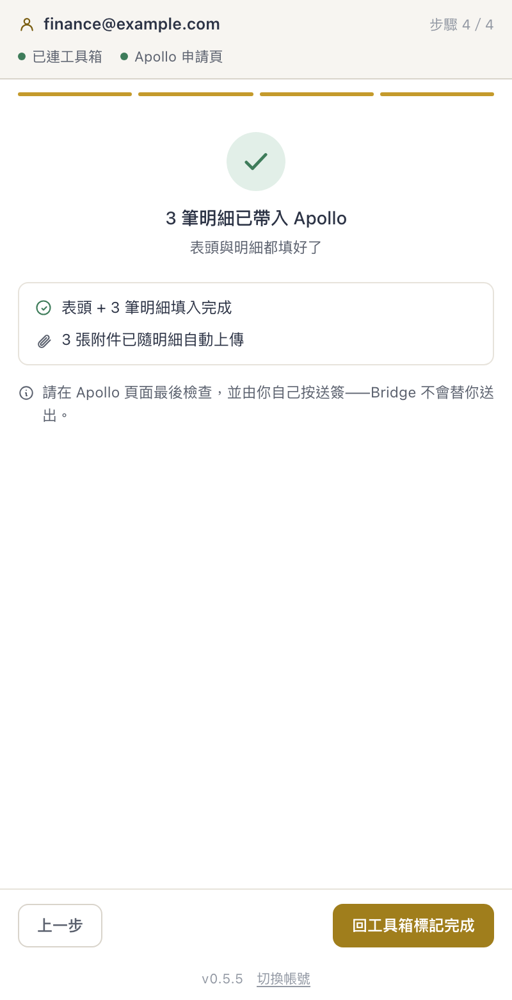

# MINGCHU 報帳工作台 + Apollo Bridge 擴充套件 — AI 協作開發紀錄

> 🤖 **我用 AI 做了什麼**：把「特助一個人在自己電腦上，用本機 skill＋兩個瀏覽器書籤，手動填公司報帳系統」的流程，做成團隊都能用的線上工作台，再加一個 Chrome 外掛，把已核准的案件**自動填進一個沒有 API 的報帳系統**。
> ⏱ **沒有 AI 的話**：3 天、50 個 commit。內容包含一套 OCR pipeline、一個全端工作台、以及逆向一個沒有 API 的 React SPA 表單並寫出填表引擎。一個人手刻，抓 1–2 個月。
> ✅ **最終成果**：上傳收據 → AI 辨識金額科目 → 人工覆核 → 外掛把**表頭、每一筆明細、每一張附件**全自動填進 MayoHR Apollo。**送簽永遠留給人按。**

---

## 一、為什麼要做這件事

客戶（MINGCHU 名廚）的報帳流程卡在一個人身上。

特助用 Claude 的本機 skill 把收據辨識出來，再用兩個瀏覽器書籤（一段貼在網址列的 JavaScript）把資料塞進公司的 MayoHR Apollo 報帳系統。**它能動，而且動得不錯。**

問題不是「慢」，是**「只有她能做」**——工具裝在她的電腦、跑在她的瀏覽器、知識在她的腦袋。她請假，報帳就停擺。

所以真正要解的是**單點依賴**，不是效率。這決定了整個設計：東西必須搬到雲端、多人可用、權限分明，而且**填表這一段不能重造，要移植**——因為那兩個書籤是已經被真實環境驗證過的資產。

還有一個硬條件：**Apollo 沒有 API**。它是一個 React SPA，只能從瀏覽器端下手。這直接決定了「必須做 Chrome Extension」。

---

## 二、最終樣貌

**兩個東西，一條鏈路。**

> 📸 以下截圖全部使用**虛構的示範資料**（人名、公司、專案皆為杜撰），畫面是真的，資料不是。

### ① 報帳工作台（web，長在既有的工具箱裡）

拖上傳多張憑證（圖片或 PDF）→ 逐張顯示辨識進度 → AI 辨識金額、店家、發票號碼 → 台灣統一發票自動拆出未稅與稅額 → 明細校對 → 送特助確認 → 核准。



**送出前先擋錯**：資料不齊（收款人空白、費用說明沒填…）**不給送確認、也不給核准**，缺哪幾項直接列出來。不會等帶進 Apollo 才被表單擋、白跑一趟。



### ② Apollo Bridge 擴充套件（Chrome 側欄）

側欄只列出「已核准、你有權限」的案件。



帶入前先確認：表頭、每一筆明細（科目／成本中心／專案／費用說明）、以及附件要逐筆掛還是合併成一份 PDF。



按下去之後，**表頭 + 每一筆明細 + 每一張附件全自動填**。逐筆看得到進度，失敗會停下來說清楚原因。



**送簽永遠留給你自己按**——外掛不會替你送出。



最後那條是刻意的產品邊界，不是技術限制。自動化到「填完草稿」為止，**送出去的那一下必須有人負責**。

---

## 三、系統架構

```
┌─ 報帳工作台 (Next.js on Vercel) ──────────────────────┐
│                                                        │
│  拖上傳憑證 ──→ OCR (OpenRouter · Claude Sonnet 4.6)   │
│                     │                                  │
│                     ↓ 只抓「事實」                      │
│              決定式規則引擎                             │
│              (5% 拆稅、補充保費、必填檢查)               │
│                     │                                  │
│                     ↓                                  │
│         Google Sheets (案件/明細) + Drive (憑證原檔)     │
└───────────────────────┬────────────────────────────────┘
                        │  已核准案件 (REST + Google 登入)
                        ↓
┌─ Apollo Bridge (Chrome Extension · MV3) ──────────────┐
│                                                        │
│  側欄 (side panel) ──→ content script                  │
│                            │                           │
│                            ↓ 直接操作 DOM              │
│              MayoHR Apollo (React SPA · 無 API)        │
│              表頭 + 明細 modal + 附件 file input        │
└────────────────────────────────────────────────────────┘
                        ↓
                  [ 人工按送簽 ]
```

關鍵在於**責任切得很乾淨**：

- **AI 只負責「讀出事實」**（這張單據上寫了多少錢、什麼店、發票號碼幾號）
- **金額怎麼拆、哪些欄位必填、能不能送出，全部是程式的決定式規則**

這不是潔癖，是財務工具的底線。AI 會出錯，但它出錯的地方必須是「讀錯一個數字」（人看得出來），而不是「算錯一筆稅」（人看不出來）。

---

## 四、技術選型

| 工具 / 技術 | 選的理由 |
|---|---|
| **Next.js + Vercel** | 直接長在客戶既有的工具箱裡，不另開一個網站。登入、金鑰、部署全部沿用現成的。 |
| **Google Sheets + Drive** | 客戶的資料本來就在這。財務看得懂試算表，出事能自己去翻、能自己還原。 |
| **OpenRouter + Claude Sonnet 4.6** | 用 7 張真實單據做過評測：Sonnet 7/7，GPT-5.1 只有 5/7（它把手寫國字金額讀錯、還漏抓發票號）。**模型是測出來的，不是選出來的。** |
| **Chrome Extension (MV3, side panel)** | Apollo 沒有 API，只能從瀏覽器端下手。側欄比 popup 好——不會點一下就消失。 |
| **書籤的填表 recipe** | **移植，不重造。** 那段 JavaScript 已經被真實環境驗證過，重寫等於把踩過的坑再踩一次。 |

---

## 五、AI 怎麼幫我做的

### 分工方式

| 環節 | 誰做 |
|---|---|
| 寫程式、逆向 DOM、產生假設、寫測試 | **AI** |
| 業務判斷（哪些欄位算必填、金額怎麼認列）、提供真實素材（單據、測試帳號）、驗收 | **人** |
| 診斷 bug | **協作**——人給症狀，AI 去查真實環境找根因 |

### 提問模式：症狀描述 + 截圖驅動

我幾乎不寫規格，都是**貼截圖 + 描述症狀**：

> 「還是沒有附件？」
> 「有錯誤訊息：中斷：表頭多數欄位填不進」
> 「點進去案件的明細頁裡面，最上方有一個紅色區域，不知道那個目的是什麼?」

然後讓 AI 去查根因。這比我先想好「應該是什麼問題」再去問，效率高很多——**因為我常常想錯**。

### 關鍵轉折

**轉折一：從別人的 baseline 起步，不是從零**

第一個 commit 是「Codex 第一版報帳工作台 baseline（未經改動）」。先用另一個 AI 產出一個能跑的骨架，再用 Claude 一層層逼近正確。**空白畫布最貴**——有個可運行的錯東西，比什麼都沒有好改得多。

**轉折二：把書籤的隱性知識抽成「DOM 契約」文件**

那兩個書籤裡有大量踩過坑才知道的細節（怎麼觸發 React 的受控 input、哪個按鈕用 `.click()` 沒反應）。我請 AI 先把它**抽成一份文件**，而不是直接改寫成 Extension。

這一步看起來繞路，但它讓後面的填表引擎有據可依——而且當 Apollo 改版時，要改的是**一份文件加一份實作**，不是「去翻某段沒人看得懂的書籤」。

**轉折三：我的一句反問，改變了整個策略（最重要的一次）**

附件太大被 Apollo 擋下來。AI 提議：**在上傳時就把照片壓縮**。聽起來完全合理，我也同意了，它也做完了。

但我心裡有個疑問，就問了一句：

> **「會不會之前是合併的 PDF 超過大小?」**

AI 去查了程式碼，發現：合併 PDF 嵌入的是**原圖**（只縮顯示尺寸、不縮像素），6 張加起來 15–20MB——**真正爆掉的一直是它，不是個別單據**。

然後更關鍵的是，我們順手用那 7 張真實單據跑了一次 OCR 評測，結果：

> **壓縮後，AI 把手寫國字「肆仟伍佰肆拾伍」從 4,545 讀成了 1,555。**

**那個「完全合理」的方案，如果上線就是財務事故。**

最後定案：**單筆用原圖**（OCR 最準、稽核留全清晰），**只有合併 PDF 在 server 端降圖**（那時 OCR 早就跑完了，零風險）。實測 11.1MB → 2.9MB。

這件事我一直記著。AI 的推理很流暢，流暢到我差點沒問那一句。

---

## 六、踩到的坑

### 坑一：壓縮不能擋在 AI 前面

- **症狀**：附件太大被擋。直覺解法是上傳前壓縮。
- **根本原因**：壓縮會**落在 OCR 前面**。手寫國字金額本來就是最難讀的，壓過再讀，「肆仟伍佰肆拾伍」變成 1,555。
- **解法**：壓縮只放在**產物**上（合併 PDF，post-OCR），原始憑證一律不動。
- **帶走的原則**：**任何處理只要會落在 AI 的輸入端，就要當成「改變了題目」來驗證。**

### 坑二：「回報成功」≠「真的填進去」

- **症狀**：外掛顯示 6 筆全綠打勾，Apollo 表單裡只有 2 筆。
- **根本原因**：填表程式無條件回報成功——它按了「確認」，但沒檢查表單有沒有真的收下。
- **解法**：按完確認後，**驗證「已新增 N 筆」有沒有增加、視窗有沒有關掉**，才算成功。
- **帶走的原則**：**自動化最該防的不是失敗，是「假成功」。** 失敗會被發現，假成功會被信任。

### 坑三：必填清單用猜的，會誤擋合法案件

- **症狀**：要做「資料不齊不給送出」的防呆，得先知道哪些欄位是必填。
- **根本原因**：憑直覺列的清單裡，「專案／項目」和「發票號碼」看起來都該是必填。
- **解法**：直接去讀 Apollo 表單上每個欄位標籤有沒有那顆紅色星號——**結果那兩個都不是必填**。照猜的做，會擋掉合法案件。
- **帶走的原則**：**規則要去「權威來源」讀，不要從常識推。**

### 坑四：程式說「我藏起來了」，畫面說「我沒有」

- **症狀**：一條沒有內容的紅色橫幅賴在畫面上。程式明明設了隱藏。
- **根本原因**：那個元件的 CSS 有 `display: flex`，**它蓋過了瀏覽器內建的隱藏規則**。JavaScript 回報 `hidden = true`，畫面照樣顯示。
- **解法**：加一條全域規則讓「隱藏」真的能贏。
- **帶走的原則**：**「程式回報的狀態」和「使用者看到的畫面」是兩件事。** 這個坑是靠截圖抓到的——只信程式的回傳值就會被騙過去。

### 坑五：只會在別人身上發作的 bug

- **症狀**：無。在我的帳號上完全正常。
- **根本原因**：解析登入憑證時用了非 UTF-8 安全的解碼。如果 Google 帳號的名字是**中文**，解碼會爆掉 → 憑證被誤判過期 → **每次都要重新登入**。
- **解法**：改用 UTF-8 安全的解法，並補上中文名字的測試案例。
- **帶走的原則**：**「在我機器上是好的」對團隊工具毫無意義。** 中文名字、長 email、多重帳號——這些邊界要主動去想，因為它們不會在你身上發生。

---

## 七、Takeaway

### 這個案例展示的思路：**用查證取代推理**

整個專案裡，AI 寫的程式碼幾乎都對。**出事的地方全部是「大家一起合理地推理，然後推錯」。**

三次關鍵時刻，都是靠「去查」而不是「去想」翻盤的：

| 我們原本以為 | 去查了之後 |
|---|---|
| 壓縮圖片可以解決附件過大 | 跑 OCR 評測 → 壓縮會讓 AI 把 4,545 讀成 1,555 |
| 「專案／項目」應該是必填 | 讀 Apollo 表單的星號 → **它不是必填**，當必填會誤擋 |
| 程式說隱藏了，那就是隱藏了 | 截圖一看 → **東西還在畫面上** |

**AI 的推理很流暢，流暢到你會忘記要求證。** 而它最危險的時候，不是說「我不知道」，是說「這樣做很合理」。

### 可移植性

**可以直接複製的：**
- **症狀描述 + 截圖驅動**的提問方式（不要先想好答案再問）
- **從一個能跑的錯東西開始**，而不是從空白畫布
- 把**已驗證的舊資產先抽成文件**，再重寫（移植 > 重造）
- **AI 只抓事實、規則交給程式**——凡是「算錯了人看不出來」的東西，都不要交給 AI

**這個案例的特殊條件（不要照單全收）：**
- 我手上有**真實測試素材**（7 張各式單據 + 一個測試帳號）。沒有這些，OCR 評測和 DOM 逆向都做不了——**這是這個專案能成的前提，不是附加品**。
- 目標系統的 DOM 相對穩定。如果對方三天兩頭改版，這套填表引擎會很脆。

### 如果你也要做，先問 AI 什麼

> **起手式一（逆向一個沒有 API 的系統）：**
> 「我要自動化一個沒有 API 的網頁系統。我手上有一段能動的舊腳本。**請先不要改寫它**——先幫我把它逆向成一份文件：它依賴哪些 DOM 結構、哪些操作順序是必要的、哪些地方是踩過坑才這樣寫的。我要先看懂，再決定怎麼重寫。」

> **起手式二（任何會經過 AI 的資料處理）：**
> 「我打算在 [某個步驟] 加上 [壓縮／裁切／轉檔]。**這個處理會不會落在 AI 的輸入端？** 如果會，請幫我設計一個用真實素材的評測，證明它不影響辨識結果——在我們改之前。」

---

_開發日期：2026-07-12 ～ 2026-07-14（3 天 · 50 個 commit）_
_整理日期：2026-07-14_
