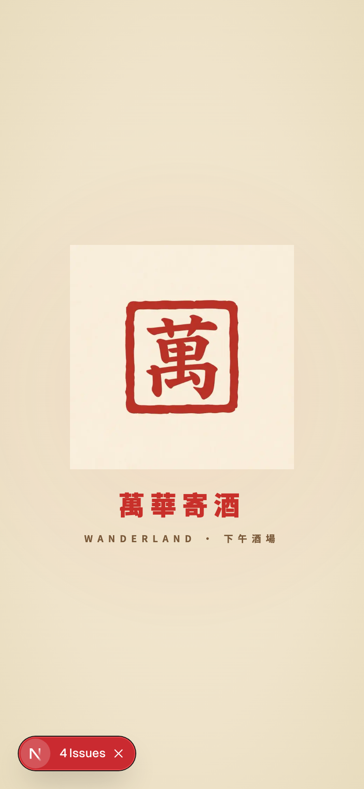
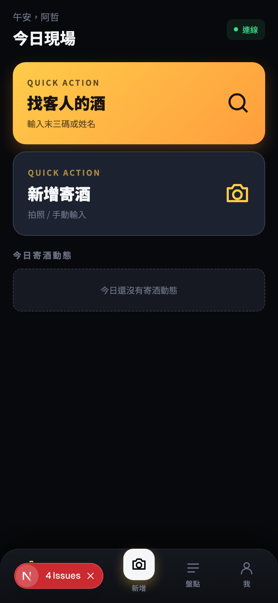
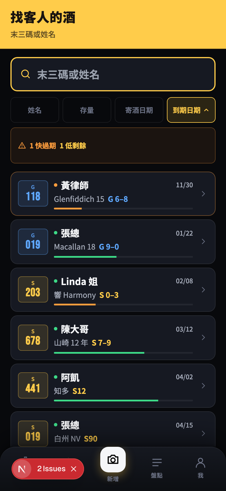
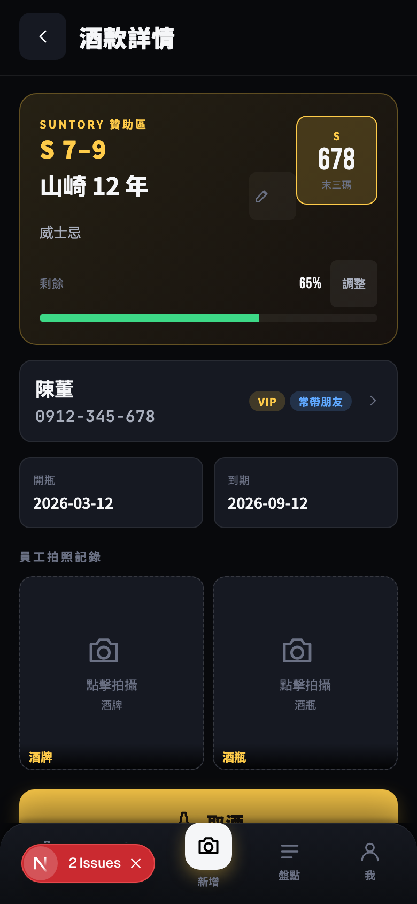
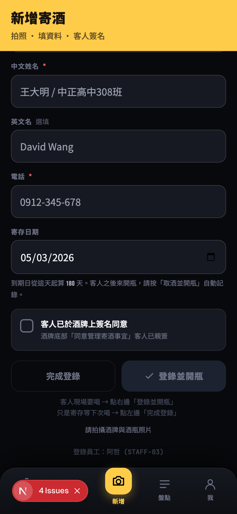
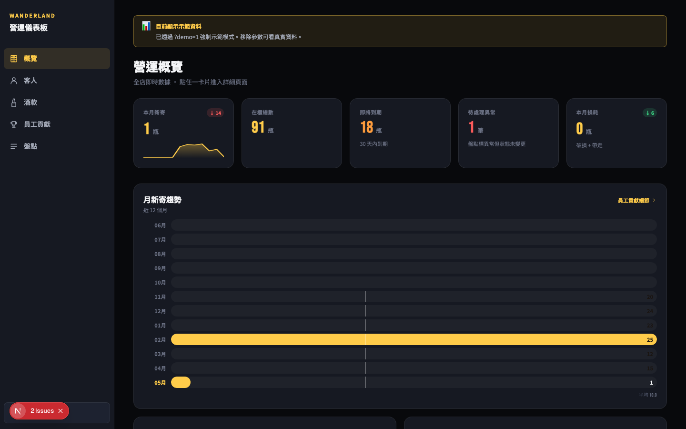
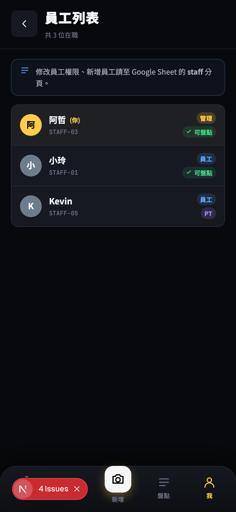

# 萬華世界 下午酒場 · 寄酒管理系統 — AI 協作開發紀錄

> 🤖 **我用 AI 做了什麼**：5 天內從 0 開發出一個正式營運的寄酒管理 PWA — 員工版手機 + 管理版桌機儀表板 + 客人 QR 自助查詢頁，背後接 Google Sheets 當資料庫。
> ⏱ **沒有 AI 的話**：找一個全端工程師至少 4-6 週起跳；自己學整套 stack 從頭做，估計 2-3 個月 + 大量挫折，多半半途而廢。
> ✅ **最終成果**：[wl-bottle.vercel.app](https://wl-bottle.vercel.app) — 119 commits / 5 天 / 包含 AI OCR 拍照辨識、PWA 安裝、印章風 hanko icon、雙段啟動動畫、完整試行→正式上線 SOP。

> 萬華世界 下午酒場是台北萬華的一間日式酒場，過去寄酒紀錄全靠 Google Sheet 手刻。試行了 5 天的 AI 協作開發，把它變成一支手機就能搞定的工具。

---

## 一、為什麼要做這件事

寄酒（bottle keep）是日式酒場常見的客人服務 — 客人開了一支沒喝完的酒，存在店裡下次來繼續喝。但「誰寄了什麼酒、寄在哪一格、什麼時候開的、剩多少」這些資料，傳統作法就是一張紙寫一寫釘在酒上、一本本子記。

我們的店原本用 Google Sheet 維護整套，但問題很現實：

- **店員找客人的酒要爬一大張表** — 客人坐下說「我之前寄一瓶山崎，幫我倒一杯」，店員要在表上 Ctrl+F 搜半天
- **盤點是場惡夢** — 70 多瓶酒分 7 區，每月要對一次帳，沒人想做
- **店長想看「這個月生意怎樣」要自己拉樞紐分析** — 翻 Sheet 翻到崩潰
- **客人不知道自己寄了什麼** — 來店問店員、店員再翻表查
- **資料容易跑掉** — 手機輸入電話自動把開頭 0 吃掉、姓名打錯，每幾週就要清資料

我有一點 vibe coding 的經驗（之前做過萬華世界的營收儀表板、薪資模組），但這次規模更大 — 是一個多角色（員工 + 管理 + 客人）、多 device（手機 + 桌機）、多功能（CRUD + AI + auth + Drive）的 production 工具。

賭一把：**用 5 天試試看 AI 能不能把這個做出來**。

---

## 二、最終樣貌

5 天後的成品涵蓋三個角色的完整流程：

### 開場：朱印 hanko 風 brand identity

App icon、splash 動畫、客人查詢頁全部統一在這個視覺：米色和紙底、朱紅「萬」字方印。



### 員工版手機 PWA（核心，每天用）

主畫面：問候語 + 兩個 quick action card（找客人的酒 / 新增寄酒）+ 今日寄酒動態 feed。



「找客人的酒」是員工最常用的功能。一個搜尋框 + 4 種排序 + 上方 alert banner 提示需要關注的酒：



點任一瓶進酒款詳情：客人卡（含 VIP / 常帶朋友 tag）+ 剩餘量條 + 開瓶/到期 + 員工拍照記錄 + 完整事件時間軸（往下捲）。S7-9 是 Suntory 區的子分區，黃色 hero 是 Suntory 視覺、藍色 hero 是一般區：



新增寄酒：頁底拆雙 CTA — 灰底 outline「完成登錄」（純存酒）vs 金色 primary「登錄並開瓶」（客人現場要喝，一鍵搞定）。



### 管理版桌機儀表板 `/admin`

員工版手機 PWA 解決不了的「全店分析」，獨立桌機介面（不是另一個 app — 同一個 codebase 的另一個路由分組）：



- **概覽**：5 KPI 卡（本月新寄 / 在櫃 / 即將到期 / 異常 / 月損耗）+ 12 月趨勢
- **客人深度**：VIP 名單 + 追單名單（30+ 天未到店的高貢獻客）+ 新客 + 活躍度
- **酒款分析**：即將到期清單 + 月損耗趨勢 + 品牌分佈 + 類別分佈
- **員工貢獻**：12 月 stacked bar + 半年排行 + 月對月對比
- **盤點健康度**：7 區方格 + 未處理異常清單

員工列表（手機版）— 角色 / 雇用類型 / 可盤點權限三個 dimension 並列，PT 和外援用對比鮮明的 pill 視覺區分：



### 客人版 QR 自助查詢 `/c/<token>`

員工幫客人在客人詳情頁產生 QR Code，客人掃了之後不用登入就能查自己所有寄酒：

- 列表頁（在櫃 + 已結束折疊）
- 每瓶飲用紀錄時間軸
- HMAC 簽章 token 防偷看別人的酒
- 連結永久有效，可加書籤

### 品牌設計

從寫實插畫風 icon → 朱印 hanko 風 flat design：

- App icon：米色和紙底 + 朱紅「萬」字方印
- PWA Splash：兩段式（HTML 立即顯示 + React 動畫接手）
- 客人查詢頁：萬華世界印章 hero

---

## 三、系統架構

```
┌─────────────────────────────────────────────────────────────┐
│  Frontend (Next.js 15 App Router + React 19)                │
│  ├─ (app)/        員工版 mobile PWA                          │
│  ├─ (admin)/      管理版桌機 dashboard                       │
│  └─ c/[token]/    客人公開查詢頁                              │
└──────┬──────────────────┬──────────────────┬─────────────────┘
       │                  │                  │
       ▼                  ▼                  ▼
┌──────────────┐  ┌──────────────┐  ┌──────────────────┐
│ Auth.js v5   │  │ Vercel       │  │ HMAC token       │
│ Google OAuth │  │ Serverless   │  │ (per-guest)      │
│ + Sheet 白名單│  │ API Routes   │  │ AUTH_SECRET 簽章 │
└──────┬───────┘  └──────┬───────┘  └──────────────────┘
       │                 │
       ▼                 ▼
┌─────────────────────────────────────────────────────────────┐
│  Google Workspace（service account 金鑰）                     │
│  ├─ Google Sheets   bottles / guests / events / staff /     │
│  │                  inventory_cycles / inventory_sessions / │
│  │                  settings — 7 張分頁當資料庫              │
│  └─ Google Drive    Shared Drive — 酒牌 + 酒瓶照片          │
└─────────────────────────────────────────────────────────────┘
                              │
                              ▼
                ┌──────────────────────────┐
                │ AI Vision Providers      │
                │ (擇一即啟用)              │
                │ Anthropic / OpenAI /     │
                │ Gemini / Qwen / DeepSeek │
                └──────────────────────────┘
```

幾個關鍵設計：

- **Google Sheets 當資料庫**：店家本來就在用、店長看得懂，省去所有 DB / 後台介面的開發成本
- **Service account JWT**：app 直接讀寫 Sheet，不需要員工每個都要 Google 帳號授權
- **HMAC token for 客人 QR**：stateless（不用查 DB）、deterministic per guest（QR 印出來永遠有效）
- **AI provider 抽象層**：5 家 vision API 用同一個 callVisionAI 介面，env 設哪個 key 就用哪家

---

## 四、技術選型

| 工具 / 技術 | 選的理由 |
|---|---|
| **Next.js 15** (App Router) + **React 19** | 同一套 codebase 跨手機 PWA + 桌機 admin；Server Components 直接呼叫 Sheet API 不用寫額外的 API layer |
| **TypeScript** | AI 寫 code 時 type 是 spec — 比註解更可靠的協作介面 |
| **Tailwind CSS 3** | 沒有設計系統時最快的 UI 鋪法；CSS variables 處理主題（dark/light/auto）|
| **Auth.js v5 (beta)** | Google OAuth 直接整合 + JWT session 不用後端 cookie store |
| **Google Sheets API** + **service account** | 店家 Sheet 已存在；service account 一次設定終生不用管 |
| **Google Drive API** + **Shared Drive** | 照片儲存最簡單方案；Shared Drive 容量不算個人 quota |
| **多 AI provider 抽象層** | 不綁單一家；某家當機 / 漲價可以隨時換 |
| **Vercel** + **GitHub auto-deploy** | push 到 main 自動部署，不用 CI/CD config |
| **`qrcode` lib**（client） | 客人 QR canvas 在瀏覽器產生，server 不用畫圖 |
| **CSS-only 圖表** | 桌機 dashboard 不裝 chart library — bar / sparkline / 7 區 grid 純 CSS + inline SVG，bundle size 不膨脹 |

> **選型原則**：能用「店家既有資源 + 免費服務」就不引外部 SaaS。整個 stack 沒有額外月費（Vercel free tier + Google Workspace 已有）。

---

## 五、外部服務與金鑰

| 服務 / 模型 | 用途 | 類型 | 備註 |
|---|---|---|---|
| `AUTH_SECRET` | Auth.js JWT 簽章 + 客人 QR HMAC token | Secret | 旋轉這個 = 全員登出 + 所有客人 QR 失效 |
| `AUTH_URL` | OAuth callback URL | Env | production: `https://wl-bottle.vercel.app` |
| `GOOGLE_CLIENT_ID` / `GOOGLE_CLIENT_SECRET` | Google OAuth 員工登入 | API Key | OAuth Client，要在 Google Cloud Console 建 |
| `GOOGLE_SERVICE_ACCOUNT_KEY` | 後端讀寫 Sheets + Drive | Service Account JSON | 整份 JSON 壓成單行；要把 service account email 加到 Sheet + Drive 共用 |
| `GOOGLE_SHEET_ID` | 指定的試算表 | Env | URL 中間那串 |
| `GOOGLE_DRIVE_FOLDER_ID` | 照片儲存資料夾 | Env | 在 Workspace Shared Drive |
| `ANTHROPIC_API_KEY`（or 其他 4 家任一）| AI OCR 拍照辨識 | API Key | 選用，沒設就停用 AI 功能 |
| Claude Haiku 4.5 | 預設 vision model | AI Model | 中文手寫辨識最強 |
| Gemini Flash | 備胎 vision model | AI Model | 最便宜 |
| GPT-4o-mini / Qwen-VL Max / DeepSeek | 其他選項 | AI Model | 各有強項 |
| Vercel | 部署 + serverless functions | Platform | GitHub auto-deploy 到 `wl-bottle` project |

> 跑起來最少需要：`AUTH_SECRET` + 4 個 `GOOGLE_*` + Vercel 帳號 + Google Workspace。AI OCR 是 nice-to-have，沒設員工自己手 key 也可以用。

---

## 六、AI 怎麼幫我做的

### 分工方式

| 環節 | 誰負責 |
|---|---|
| 寫程式碼（all of it） | AI |
| 系統架構決策 | AI 提案 → 我選 |
| UX / Product 判斷 | 我（AI 給選項，我拍板）|
| 看到問題、拍照、描述症狀 | 我 |
| Debug 推理 + 解法 | AI |
| 視覺風格定調（木牌？hanko？）| 我（AI 製作） |
| 文件撰寫（CLAUDE.md / README / SOP） | AI |

我**從頭到尾沒寫過一行 TypeScript / React / CSS**。但每一個畫面長什麼樣、按鈕該怎麼擺、資料流要怎麼跑，都是我決定。

### 提問模式

最常用的三種：

**1. 截圖驅動**
拍手機畫面、貼進對話、講「這裡看起來怪怪的」。AI 看截圖 + 我對 UX 的口語直覺 = 它去 codebase 找對應 component 改。

**2. 症狀描述**
「我登出之後想換 Google 帳號，但它不讓我切」「PWA 開啟後會白畫面 5-8 秒」「酒牌辨識常常失敗」。我不需要知道根本原因，AI 推斷 + 我驗證。

**3. 決策對話**
「店長旁邊的 user profile 圓圈是不是該跟角色顏色一致？」「員工分成正職/PT/外援，介面要怎麼區隔？」「正式上線前要清空 Sheet，你建議怎麼做？」AI 給選項 + 各自 pros/cons + 它的推薦，我決策。

### 5 個關鍵轉折

**轉折 1：從 PIN demo → 真實 Google OAuth**

最早的版本是 demo PIN（2580）登入，後來要實際給員工用，要切真實 Google OAuth + Sheet 白名單。AI 自己處理了 Auth.js v5 beta 的 callback 鏈（signIn → jwt → session），但**最關鍵的是 prompt 模式上的轉變**：之前我每次 debug 是「貼錯誤訊息」，這次改成「AI 主動建議怎麼設定 GCP」「用 service account 比 OAuth 簡單，這樣那樣」— AI 變成 GCP 顧問。

**轉折 2：AI OCR 從研究 → 多 provider 抽象 → 截斷 recovery**

最初是「想加 OCR 但不知道用哪家」，AI 列了 5 家 vision API 比較。我的選擇是「全都接、env 設哪個用哪個」— AI 設計出抽象層 callVisionAI(prompt, base64, mediaType)，5 家共用同一個介面。

後來發現 Claude Haiku 偶爾回傳的 JSON 被截斷（`max_tokens: 512` 不夠），錯誤訊息直接給使用者看是「No JSON in response: { "phone": "09...」。AI 自己補了**截斷救援邏輯** — 如果 `{` 開頭沒有 `}`，自動丟掉最後一個 unterminated string、補上 `}`、re-parse。救回大半被截斷的 case。

**轉折 3：手機 only → 加桌機儀表板，同一個 codebase**

員工版手機 PWA 上線一陣子之後，店長提需求：「我要看『這個月生意如何、誰是 VIP、哪些酒快過期』」。我問 AI：「不要做新 app、能不能在現有專案加桌機儀表板？」

AI 設計出 `(admin)` route group：
- 跟 `(app)` 平行，不繼承 mobile 的 PhoneFrame / TabBar
- Manager-only auth gate
- CSS-only 圖表（無 chart lib）— bar chart 純 div 寬度、sparkline 純 inline SVG
- 真實資料 < 50 筆時自動 fallback mock data，UI 顯示 DEMO badge

**同一個 codebase 同時服務手機員工、桌機店長、客人 QR — 路由分組是關鍵抽象**。

**轉折 4：icon 從寫實插畫 → flat hanko**

我先試了三張不同的 icon（單瓶寫實、bottle+tag combo、單木牌寫實），ChatGPT 生的圖。AI 的 feedback 對我打到：

> 「這兩張是 2010 年代的 fake-gold 風格，現在主流 app icon 是 flat、克制、有設計感。多物件 + 多文字 + 細紋理在 60×60 主畫面尺寸下會變成『一坨咖啡色 + 黑色』。」

然後 AI 用 nano banana API 直接生兩個版本：朱印（hanko）+ 極簡幾何。最後選朱印 — 米色和紙 + 紅色「萬」字方印，flat、品牌專屬、小尺寸辨識度高。

> Splash 動畫也跟著改成 hanko 風 — 米紙底 + 印章中央 + 紅色「萬華寄酒」字樣。整個 brand language 才一致。

**轉折 5：PWA cold start 白畫面 — 三段式 race condition**

「我點主畫面 icon 開 PWA，會出現 5-8 秒白畫面才看到動態效果。」

AI 拆解這 5-8 秒：
1. iOS 端 OS 的 pre-HTML 白（沒辦法消滅，需要 apple-touch-startup-image）
2. Vercel cold start lambda 喚醒（~2 秒）
3. HTML 抵達前的空白
4. React 沒 hydrate 完成的空白

提了 3 個解法：HTML 等級 boot splash + manifest background_color + WelcomeSplash 接手。

第一版上線後我說：「我會先看到首頁的部分才會跳到動態，然後又回到首頁。」

AI 馬上抓出原因：boot-splash 已經開始 fade，但 React 還沒 commit welcome-splash 到 DOM，那 16-50ms 之間首頁被看到。**改成 `useLayoutEffect` 等到 welcome-splash 確定 mount 之後才 hide boot-splash**。完美修好。

> 這種「有兩個獨立 timer 的 race condition」在純文字描述下 AI 很難猜到，但給它「我看到 X，但其實希望看到 Y」的症狀，它推理出 useEffect vs useLayoutEffect 的時機差異 — 這就是症狀驅動的威力。

---

## 七、踩到的坑，讓我更懂的事

5 天 119 commits 累積的踩雷紀錄。每條都有變成 CLAUDE.md 的 Common Pitfalls 留給下個 session。

### 坑 1：Google Sheets 把電話開頭的 0 吃掉

寫 `"0917643057"` 進 sheet，cell 變成 `917643057`。原因是 Sheets 預設把純數字字串當 number。

**解法**：寫入前先包一個 `asText(value)` — 字串前加單引號 `'`（Sheets 看到單引號就知道要存成 text）。

> 帶走的原則：**Google Sheets 不是單純的「字串資料庫」** — 它有 type coercion 邏輯。每個 leading-zero 欄位都要過 asText。

### 坑 2：Workspace Shared Drive 隱形 404

API 直接呼叫 Drive 裡 Shared Drive 的資料夾，永遠回傳「File not found」。

**解法**：`supportsAllDrives: true` + `includeItemsFromAllDrives: true` 兩個 flag 必須加在每個 Drive API call 上。

> 帶走的原則：**Google Workspace 的 Shared Drive 跟個人 My Drive 是兩個世界**。一個 default 工作不通另一個。

### 坑 3：Vercel serverless 不能用 module-level cache

最早 `bottles.ts` 跟 `guests.ts` 有 15 秒 in-memory cache 加速。問題：寫完一筆酒、router.refresh，下一個 render 落在另一個 lambda instance，cache 還是舊的 — 使用者看到「我剛剛改成 75% 但 UI 還是 60%」。

**解法**：拿掉 module-level cache。每次 render 直接打 Sheet。

> 帶走的原則：**stateless serverless 不能假設 instance affinity**。要快取要嘛用 distributed cache（Redis/Upstash），要嘛用 Next.js `unstable_cache` 配 tags。

### 坑 4：Vercel worktree 自動 link 到錯的 project

我用 git worktree 開分支開發，第一次 `vercel --prod` 自動建了一個叫 `peaceful-yonath-425020` 的新 project，跟正式的 `wl-bottle` 不同。表面上 deploy 成功了但 `wl-bottle.vercel.app` 沒更新。

**解法**：`rm -rf .vercel && vercel link --project wl-bottle --yes`，把 worktree 強制 link 到正確 project。日常 deploy 改用 `git push origin main`（GitHub integration auto deploy），CLI deploy 留給 webhook 失靈時。

### 坑 5：React 19 strict mode dev 雙觸發 → splash 不顯示

最早的 WelcomeSplash 一進去就把 `sessionStorage.setItem("shown")` 設掉，然後檢查同一個 flag 決定要不要播。

問題：React 19 dev strict mode 會 mount → unmount → remount。第一次 mount 設了 flag、被 unmount 丟掉；第二次 mount（真正使用者看到的）讀 flag 看到 "shown"，直接 skip。整個 splash 永遠看不到。

**解法**：flag 只在 splash 真的播完之後才寫。

> 帶走的原則：**dev strict mode 是測試你 effect 是否 idempotent 的免費機會**。如果 effect 寫了不可逆的副作用，第二次 mount 就會撞牆。

### 坑 6：AI vision provider 回傳的 JSON 被截斷

Claude Haiku 偶爾回 `{ "phone": "0917643057", ...` 然後就沒了，沒有 `}`。原因：`max_tokens: 512` 被吃光，model 還沒寫完 JSON。

**解法**：（1）max_tokens 提高到 1024；（2）`parseLooseJson` 加截斷救援 — 找 `{`、丟掉最後一個 unterminated string（在最後一個 `,` 之後）、補上 `}`、re-parse。救回大半 case。

> 帶走的原則：**AI provider 不會永遠守規矩**。你的 parser 要 robust to 部分輸出，不要 assume 完整 JSON。

### 坑 7：PWA cold start 三重白畫面

從點 icon 到看到內容要 5-8 秒，全程白畫面。

**解法**（三層防線）：
1. `manifest.background_color: #efe3ca` 米色 — Android cold start 用這色
2. `#boot-splash` HTML 元素 — HTML 一抵達就顯示 hanko，pure CSS pulse 動畫
3. WelcomeSplash 用 `useLayoutEffect`（不是 useEffect）— 確保自己 mount 之後才隱藏 boot-splash，避免首頁閃過

**剩下打不到的部分**：iOS 端 OS 的 pre-HTML 白（要 apple-touch-startup-image，要為每個 iPhone 尺寸生圖）。這段是 OS 自己的事，能力範圍外。

> 帶走的原則：**PWA「白畫面」不是單一問題、是 5 個獨立階段疊加**。要拆解每個階段才能各個擊破。

### 坑 8：sync-context 不只是 documentation，是 AI 協作的剛需

AI 沒有跨 session 的記憶。每個 session 一開始它都是白紙。

我每寫完一個重要 feature 就會跑 `/sync-context` — 把這次學到的 conventions、踩到的坑、做了什麼決策、寫進 CLAUDE.md。下個 session 開頭 AI 自動 read 這個檔，幾秒內進入狀況。

5 天 119 commits 之間，CLAUDE.md 被 sync 了 4 次。沒有這 4 次 sync，後面的 session 都會問「為什麼 phone 要 asText」「為什麼不 cache」「manager_pin 要不要放 Staff type」這些已經回答過的問題，重新繞一圈才會做對。

> 帶走的原則：**CLAUDE.md 是 AI 的 long-term memory**。它的價值跟 commit message 不一樣 — commit 是給人看的歷史，CLAUDE.md 是給 AI 看的工作規格。維護它的成本（每幾個 session 跑一次 sync）遠低於每次重新解釋的成本。

---

## 八、如果繼續往下

短期可以繼續做的：

- **Notification 系統**：客人到店、即將到期推播。Web Push / LINE Notify / Email 任一家都可以接，目前 settings 已有 `reminder_days` 等設定，連結客人 QR token 就能做帶簽連結的提醒
- **盤點異常 → 正式狀態快捷流程**：目前異常只記到 events，店長要手動到酒款詳情頁用 PIN 標記破損 / 帶走。可以在異常清單上加直接帶 PIN prompt 完成正式變更
- **`/admin` 真實資料 KPI 驗證**：等 events ≥ 50 自動切到 real mode 後，重新驗證所有 KPI 計算對得上 Sheet，視需求加時段分析、新客 vs 回頭客比例、Export to CSV
- **更多 AI prompt 微調**：目前酒瓶 OCR 只認 7 種類別，遇到沒列的（白蘭地、利口酒）會被歸到「其他」，可以擴充類別 set 或讓 AI 提建議

長期：

- **多店家版本**：把 `GOOGLE_SHEET_ID` 抽成 per-tenant 設定，做成 SaaS 給其他酒場使用
- **iPad 專用佈局**：目前 iPad 用桌機版佈局，但握法跟桌機不同，可以做專屬版

---

## Takeaway

### 這個案例展示了什麼思路或 AI 使用方式

**「Director 模式」的 AI 協作**：我從頭到尾不寫程式碼，但每個 product 決策、每個 UX 細節、每個視覺風格都是我下判斷，AI 是執行者。這跟「pair programming」很不一樣 — 不是兩人協作寫 code，而是「導演 + 製片」的關係：

- 我負責：**為什麼做、做什麼、做得對不對**
- AI 負責：**怎麼做、實作、debug、文件**

這個分工的前提是**症狀驅動的 debug 能力** — 我會描述「看到什麼但希望看到什麼」，AI 推理根本原因。我不需要學 React 內部、不需要懂 Auth.js v5 callback chain、不需要研究 Google Drive Shared Drive 為什麼要 supportsAllDrives，但我能精準說出哪裡不對勁。

### 可移植性聲明

**可以複製的**：

- 用 Google Sheets 當 production database 給「資料量 < 5 萬筆 + 店家本來就在用」的場景，是被低估的選項
- AI provider 抽象層（多家 vision API 同一介面）— 不綁單一廠商
- `(app)` / `(admin)` / 公開 `c/` 路由分組同 codebase 服務多角色 — Next.js 的 route group 是關鍵抽象
- HMAC token + stateless 公開連結（客人 QR）— 不用 DB 就能做 secure link
- `CLAUDE.md` + `/sync-context` 的工作流 — 任何跨 session 的 AI 開發都該做

**不能照搬的**：

- 5 天從零到 production 的速度，前提是**撰寫者已經有 vibe coding 經驗**（之前做過營收儀表板 / 薪資模組），不是純白紙。第一次玩這個的人應該預期 2-3 倍時間
- Google Sheets 當 DB 的 trade-off — 寫入 latency 約 200-500ms，不適合高頻寫入或 real-time 場景
- 「Director 模式」的有效性取決於你對該領域的 product / UX sense — 我做酒場工具因為自己懂酒場，做別領域 AI 給的選項我也選不準

### 如果你也要做，先問 AI 什麼

**起手式 1（架構先談）**：
> 「我想做一個 [你的領域] 的工具，使用者是 [角色 A / B / C]。我自己懂 [Y / N]，會用的工具有 [Google Sheet / Notion / Airtable / 其他]。給我 3 個 stack 選項加 pros/cons，重點是『最少額外服務、最容易維護』。」

**起手式 2（資料模型先確定）**：
> 「這是我目前用 [Sheet / Notion 表格] 維護的資料樣本（貼一段）。我想做一個工具讓 [使用者] 能 [動作 A / B / C]。請幫我設計：（1）資料表 schema 改怎麼動？（2）如果要保留向下相容（不 break 現有資料）要注意什麼？」

兩個起手式的共同點：**先把『不寫程式也能釐清的事』釐清完，再讓 AI 開始寫 code**。架構錯了 / 資料模型錯了 / 角色定義錯了，後面寫再多 code 都白搭。

---

## 開發時間線（給工程師補充參考）

| 階段 | 日期 | commits | 主要產出 |
|---|---|---|---|
| Phase 1：基礎架構 | 4/29-30 | ~25 | 7 張 Sheet + Auth.js + Drive 上傳 + 5 個主畫面 |
| Phase 2：核心功能完整 | 4/30-5/1 | ~25 | 帶走/轉送/破損 + 客人詳情 + 盤點 cycle + 排行 |
| Phase 3：UI polish + AI OCR | 5/1 | ~20 | 多 provider AI + Suntory + sort chips + 編輯 metadata |
| Phase 4：文件 + 跨 device | 5/1-2 | ~15 | 手動匯入指南網頁化 + tablet 斷點 + loading skeletons |
| Phase 5：桌機儀表板 + 客人 QR | 5/2 | ~15 | `/admin/*` + `/c/<token>` + 客人 QR modal |
| Phase 6：精修 + 上線準備 | 5/3 | ~19 | hanko icon + 雙段 splash + 雇用類型 + 雙 CTA + 副 filter + production cutover SOP |

整理自 git log 119 commits + CLAUDE.md + README.md，2026-05-03。

_開發日期：2026-04-29 ~ 2026-05-03_
